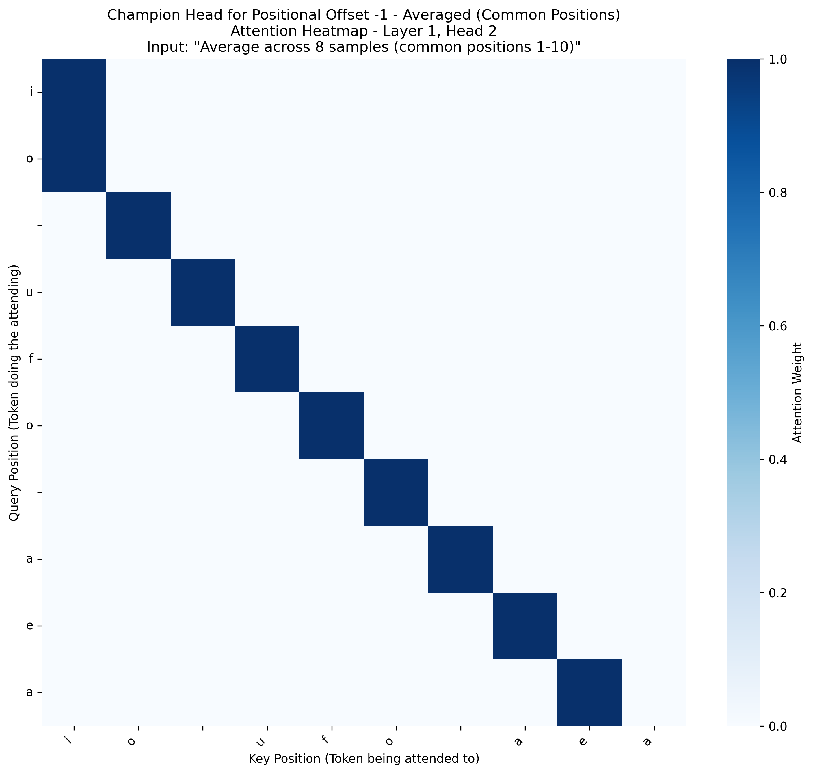
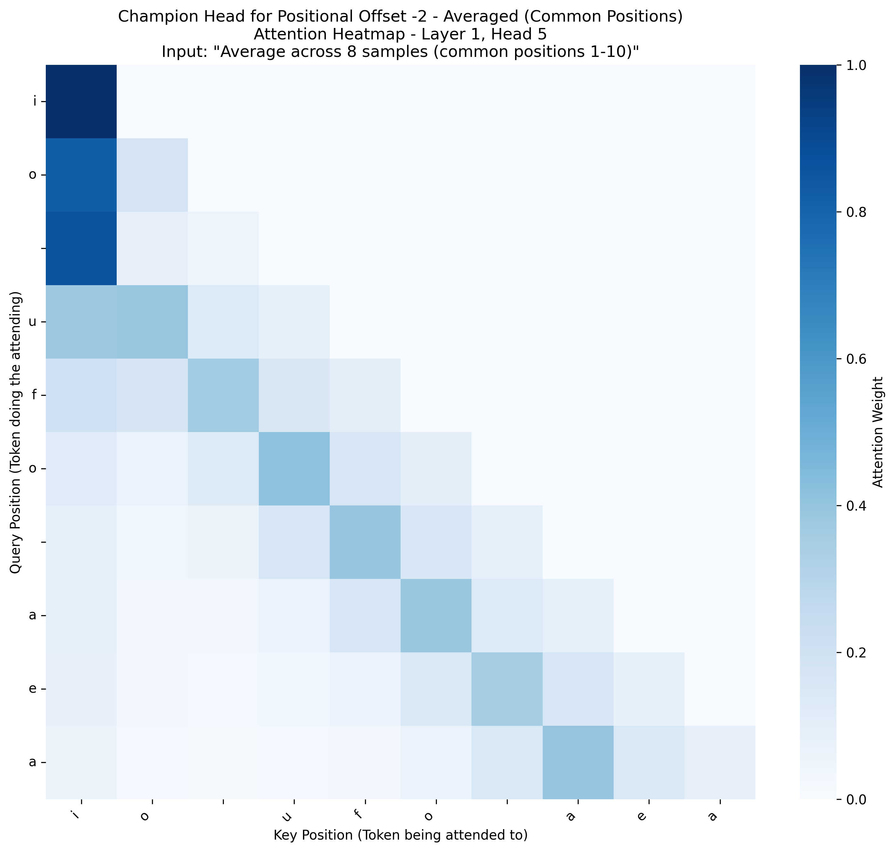
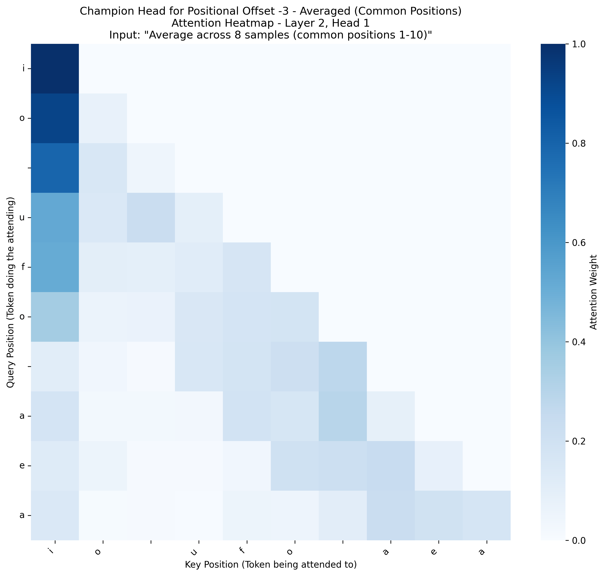
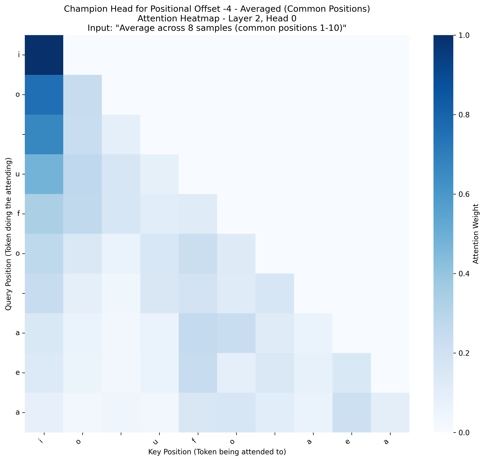
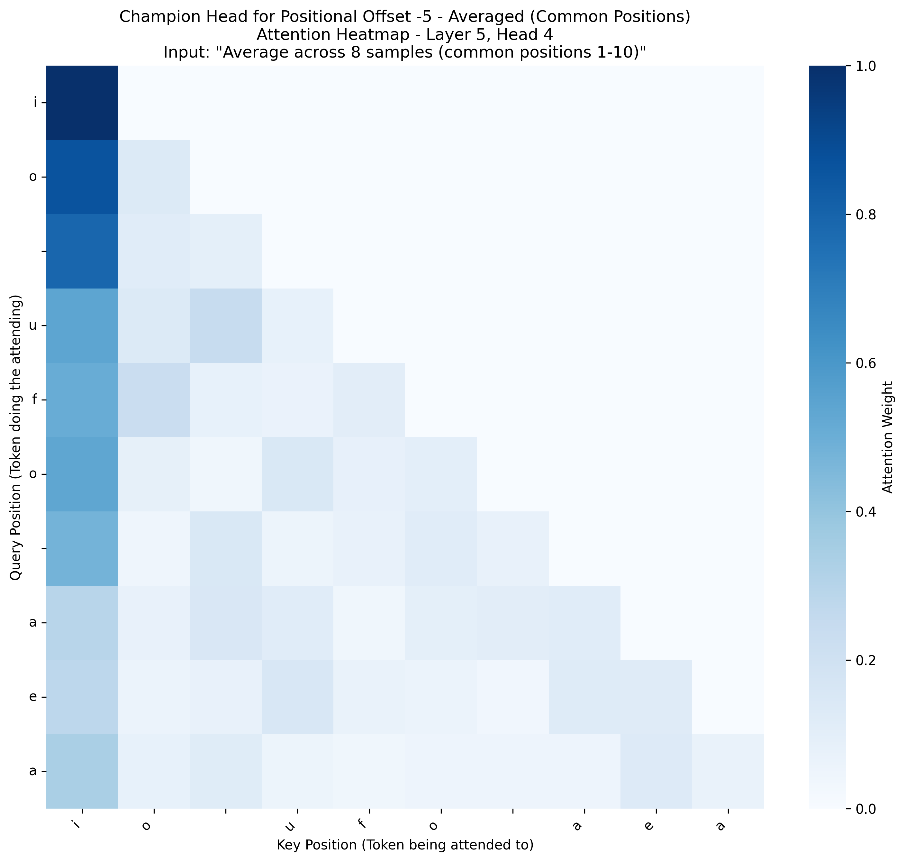
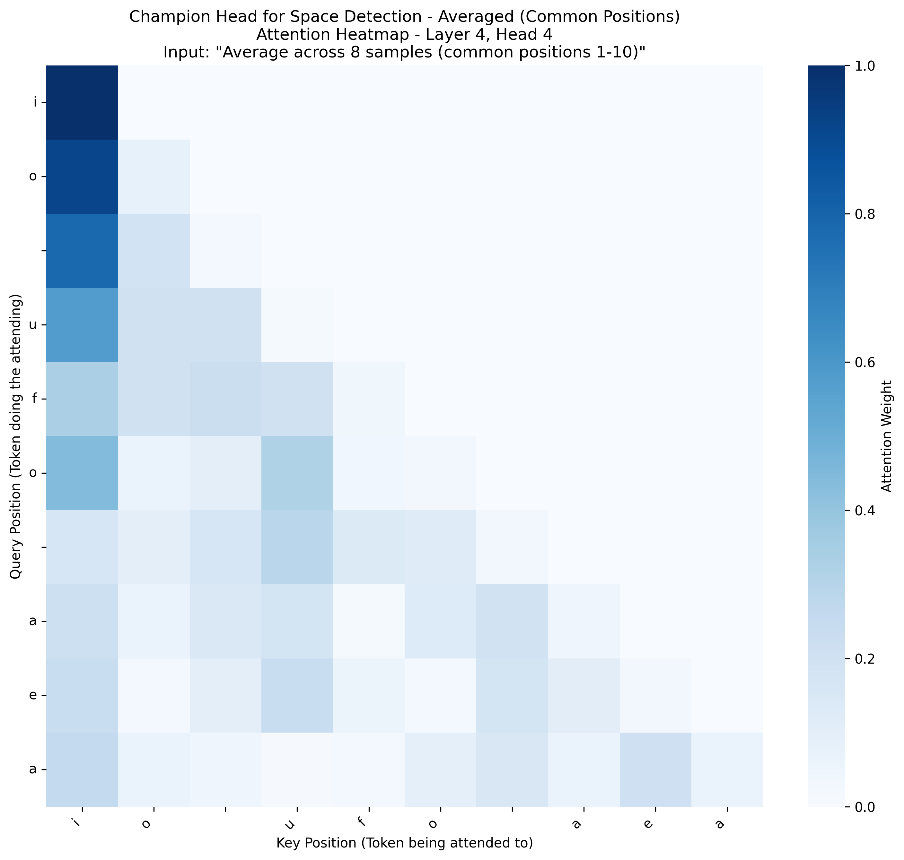
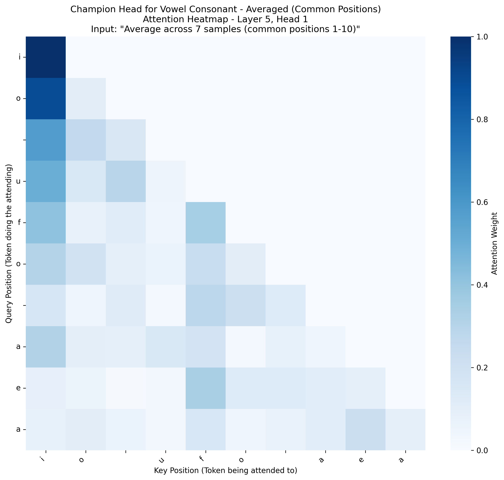

# Task-Based Attention Analysis Report (English)

This report identifies the single best attention head for several key linguistic tasks based on average scores across all samples.

## Task: `positional_offset_-1`
- **Champion Head**: Layer 1, Head 2
- **Average Activation Score**: 0.9958
- **Number of Samples**: 8
- **Sequence Length Range**: 10-45 (averaged over common positions 1-10)
- **Conclusion**: This head appears to be specialized for this task. (Threshold: 0.5)
- **Averaged Heatmap**: 
- **Individual Sample Heatmaps**:
  - [Sample 1](./champion_head_english_positional_offset_-1_sample_1.png)
  - [Sample 2](./champion_head_english_positional_offset_-1_sample_2.png)
  - [Sample 3](./champion_head_english_positional_offset_-1_sample_3.png)
  - [Sample 4](./champion_head_english_positional_offset_-1_sample_4.png)
  - [Sample 5](./champion_head_english_positional_offset_-1_sample_5.png)
  - [Sample 6](./champion_head_english_positional_offset_-1_sample_6.png)
  - [Sample 7](./champion_head_english_positional_offset_-1_sample_7.png)
  - [Sample 8](./champion_head_english_positional_offset_-1_sample_8.png)

## Task: `positional_offset_-2`
- **Champion Head**: Layer 1, Head 5
- **Average Activation Score**: 0.3932
- **Number of Samples**: 8
- **Sequence Length Range**: 10-45 (averaged over common positions 1-10)
- **Conclusion**: This head appears to be specialized for this task. (Threshold: 0.2)
- **Averaged Heatmap**: 
- **Individual Sample Heatmaps**:
  - [Sample 1](./champion_head_english_positional_offset_-2_sample_1.png)
  - [Sample 2](./champion_head_english_positional_offset_-2_sample_2.png)
  - [Sample 3](./champion_head_english_positional_offset_-2_sample_3.png)
  - [Sample 4](./champion_head_english_positional_offset_-2_sample_4.png)
  - [Sample 5](./champion_head_english_positional_offset_-2_sample_5.png)
  - [Sample 6](./champion_head_english_positional_offset_-2_sample_6.png)
  - [Sample 7](./champion_head_english_positional_offset_-2_sample_7.png)
  - [Sample 8](./champion_head_english_positional_offset_-2_sample_8.png)

## Task: `positional_offset_-3`
- **Champion Head**: Layer 2, Head 1
- **Average Activation Score**: 0.1769
- **Number of Samples**: 8
- **Sequence Length Range**: 10-45 (averaged over common positions 1-10)
- **Conclusion**: This head appears to be specialized for this task. (Threshold: 0.1)
- **Averaged Heatmap**: 
- **Individual Sample Heatmaps**:
  - [Sample 1](./champion_head_english_positional_offset_-3_sample_1.png)
  - [Sample 2](./champion_head_english_positional_offset_-3_sample_2.png)
  - [Sample 3](./champion_head_english_positional_offset_-3_sample_3.png)
  - [Sample 4](./champion_head_english_positional_offset_-3_sample_4.png)
  - [Sample 5](./champion_head_english_positional_offset_-3_sample_5.png)
  - [Sample 6](./champion_head_english_positional_offset_-3_sample_6.png)
  - [Sample 7](./champion_head_english_positional_offset_-3_sample_7.png)
  - [Sample 8](./champion_head_english_positional_offset_-3_sample_8.png)

## Task: `positional_offset_-4`
- **Champion Head**: Layer 2, Head 0
- **Average Activation Score**: 0.1296
- **Number of Samples**: 8
- **Sequence Length Range**: 10-45 (averaged over common positions 1-10)
- **Conclusion**: This head appears to be specialized for this task. (Threshold: 0.1)
- **Averaged Heatmap**: 
- **Individual Sample Heatmaps**:
  - [Sample 1](./champion_head_english_positional_offset_-4_sample_1.png)
  - [Sample 2](./champion_head_english_positional_offset_-4_sample_2.png)
  - [Sample 3](./champion_head_english_positional_offset_-4_sample_3.png)
  - [Sample 4](./champion_head_english_positional_offset_-4_sample_4.png)
  - [Sample 5](./champion_head_english_positional_offset_-4_sample_5.png)
  - [Sample 6](./champion_head_english_positional_offset_-4_sample_6.png)
  - [Sample 7](./champion_head_english_positional_offset_-4_sample_7.png)
  - [Sample 8](./champion_head_english_positional_offset_-4_sample_8.png)

## Task: `positional_offset_-5`
- **Champion Head**: Layer 5, Head 4
- **Average Activation Score**: 0.1035
- **Number of Samples**: 8
- **Sequence Length Range**: 10-45 (averaged over common positions 1-10)
- **Conclusion**: This head appears to be specialized for this task. (Threshold: 0.1)
- **Averaged Heatmap**: 
- **Individual Sample Heatmaps**:
  - [Sample 1](./champion_head_english_positional_offset_-5_sample_1.png)
  - [Sample 2](./champion_head_english_positional_offset_-5_sample_2.png)
  - [Sample 3](./champion_head_english_positional_offset_-5_sample_3.png)
  - [Sample 4](./champion_head_english_positional_offset_-5_sample_4.png)
  - [Sample 5](./champion_head_english_positional_offset_-5_sample_5.png)
  - [Sample 6](./champion_head_english_positional_offset_-5_sample_6.png)
  - [Sample 7](./champion_head_english_positional_offset_-5_sample_7.png)
  - [Sample 8](./champion_head_english_positional_offset_-5_sample_8.png)

## Task: `previous_token`
- **Champion Head**: Layer 1, Head 2
- **Average Activation Score**: 0.9958
- **Number of Samples**: 8
- **Sequence Length Range**: 10-45 (averaged over common positions 1-10)
- **Conclusion**: This head appears to be specialized for this task. (Threshold: 0.5)
- **Averaged Heatmap**: 
- **Individual Sample Heatmaps**:
  - [Sample 1](./champion_head_english_previous_token_sample_1.png)
  - [Sample 2](./champion_head_english_previous_token_sample_2.png)
  - [Sample 3](./champion_head_english_previous_token_sample_3.png)
  - [Sample 4](./champion_head_english_previous_token_sample_4.png)
  - [Sample 5](./champion_head_english_previous_token_sample_5.png)
  - [Sample 6](./champion_head_english_previous_token_sample_6.png)
  - [Sample 7](./champion_head_english_previous_token_sample_7.png)
  - [Sample 8](./champion_head_english_previous_token_sample_8.png)

## Task: `space_detection`
- **Champion Head**: Layer 4, Head 4
- **Average Activation Score**: 0.1206
- **Number of Samples**: 8
- **Sequence Length Range**: 10-45 (averaged over common positions 1-10)
- **Conclusion**: This head appears to be specialized for this task. (Threshold: 0.1)
- **Averaged Heatmap**: 
- **Individual Sample Heatmaps**:
  - [Sample 1](./champion_head_english_space_detection_sample_1.png)
  - [Sample 2](./champion_head_english_space_detection_sample_2.png)
  - [Sample 3](./champion_head_english_space_detection_sample_3.png)
  - [Sample 4](./champion_head_english_space_detection_sample_4.png)
  - [Sample 5](./champion_head_english_space_detection_sample_5.png)
  - [Sample 6](./champion_head_english_space_detection_sample_6.png)
  - [Sample 7](./champion_head_english_space_detection_sample_7.png)
  - [Sample 8](./champion_head_english_space_detection_sample_8.png)

## Task: `vowel_consonant`
- **Champion Head**: Layer 5, Head 1
- **Average Activation Score**: 0.0445
- **Number of Samples**: 7
- **Sequence Length Range**: 10-45 (averaged over common positions 1-10)
- **Conclusion**: This head shows weak specialization for this task. (Threshold: 0.05)
- **Averaged Heatmap**: 
- **Individual Sample Heatmaps**:
  - [Sample 1](./champion_head_english_vowel_consonant_sample_1.png)
  - [Sample 2](./champion_head_english_vowel_consonant_sample_2.png)
  - [Sample 3](./champion_head_english_vowel_consonant_sample_3.png)
  - [Sample 4](./champion_head_english_vowel_consonant_sample_4.png)
  - [Sample 5](./champion_head_english_vowel_consonant_sample_5.png)
  - [Sample 6](./champion_head_english_vowel_consonant_sample_6.png)
  - [Sample 7](./champion_head_english_vowel_consonant_sample_7.png)
