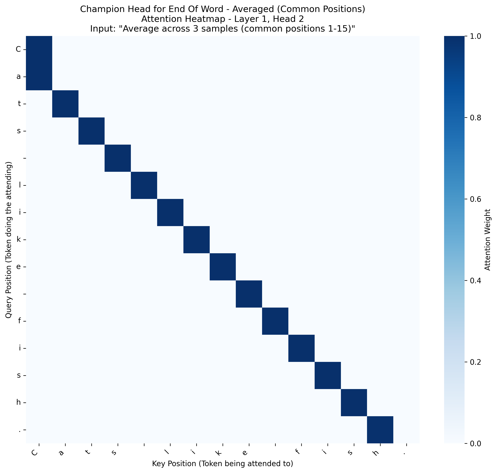

# Task-Based Attention Analysis Report (English)

This report identifies the single best attention head for several key linguistic tasks based on average scores across all samples.

## Task: `beginning_of_word`
- **Champion Head**: Layer 2, Head 2
- **Average Activation Score**: 0.2161
- **Number of Samples**: 3
- **Sequence Length Range**: 15-23 (averaged over common positions 1-15)
- **Conclusion**: This head appears to be specialized for this task. (Threshold: 0.05)
- **Averaged Heatmap**: 
- **Individual Sample Heatmaps**:
  - [Sample 1](./champion_head_english_beginning_of_word_sample_1.png)
  - [Sample 2](./champion_head_english_beginning_of_word_sample_2.png)
  - [Sample 3](./champion_head_english_beginning_of_word_sample_3.png)

## Task: `capital_letters`
- **Champion Head**: Layer 4, Head 2
- **Average Activation Score**: 0.3294
- **Number of Samples**: 3
- **Sequence Length Range**: 19-27 (averaged over common positions 1-19)
- **Conclusion**: This head appears to be specialized for this task. (Threshold: 0.05)
- **Averaged Heatmap**: 
- **Individual Sample Heatmaps**:
  - [Sample 1](./champion_head_english_capital_letters_sample_1.png)
  - [Sample 2](./champion_head_english_capital_letters_sample_2.png)
  - [Sample 3](./champion_head_english_capital_letters_sample_3.png)

## Task: `end_of_word`
- **Champion Head**: Layer 1, Head 2
- **Average Activation Score**: 0.0632
- **Number of Samples**: 3
- **Sequence Length Range**: 15-23 (averaged over common positions 1-15)
- **Conclusion**: This head appears to be specialized for this task. (Threshold: 0.05)
- **Averaged Heatmap**: 
- **Individual Sample Heatmaps**:
  - [Sample 1](./champion_head_english_end_of_word_sample_1.png)
  - [Sample 2](./champion_head_english_end_of_word_sample_2.png)
  - [Sample 3](./champion_head_english_end_of_word_sample_3.png)

## Task: `memory_head`
- **Champion Head**: Layer 1, Head 2
- **Average Activation Score**: 0.2681
- **Number of Samples**: 3
- **Sequence Length Range**: 7-19 (averaged over common positions 1-7)
- **Conclusion**: This head appears to be specialized for this task. (Threshold: 0.05)
- **Averaged Heatmap**: 
- **Individual Sample Heatmaps**:
  - [Sample 1](./champion_head_english_memory_head_sample_1.png)
  - [Sample 2](./champion_head_english_memory_head_sample_2.png)
  - [Sample 3](./champion_head_english_memory_head_sample_3.png)

## Task: `past_ed`
- **Champion Head**: Layer 2, Head 5
- **Average Activation Score**: 0.0747
- **Number of Samples**: 6
- **Sequence Length Range**: 16-22 (averaged over common positions 1-16)
- **Conclusion**: This head appears to be specialized for this task. (Threshold: 0.05)
- **Averaged Heatmap**: 
- **Individual Sample Heatmaps**:
  - [Sample 1](./champion_head_english_past_ed_sample_1.png)
  - [Sample 2](./champion_head_english_past_ed_sample_2.png)
  - [Sample 3](./champion_head_english_past_ed_sample_3.png)
  - [Sample 4](./champion_head_english_past_ed_sample_4.png)
  - [Sample 5](./champion_head_english_past_ed_sample_5.png)
  - [Sample 6](./champion_head_english_past_ed_sample_6.png)

## Task: `plural_s`
- **Champion Head**: Layer 2, Head 5
- **Average Activation Score**: 0.0966
- **Number of Samples**: 6
- **Sequence Length Range**: 13-28 (averaged over common positions 1-13)
- **Conclusion**: This head appears to be specialized for this task. (Threshold: 0.05)
- **Averaged Heatmap**: 
- **Individual Sample Heatmaps**:
  - [Sample 1](./champion_head_english_plural_s_sample_1.png)
  - [Sample 2](./champion_head_english_plural_s_sample_2.png)
  - [Sample 3](./champion_head_english_plural_s_sample_3.png)
  - [Sample 4](./champion_head_english_plural_s_sample_4.png)
  - [Sample 5](./champion_head_english_plural_s_sample_5.png)
  - [Sample 6](./champion_head_english_plural_s_sample_6.png)

## Task: `possessive_s`
- **Champion Head**: Layer 4, Head 1
- **Average Activation Score**: 0.1252
- **Number of Samples**: 6
- **Sequence Length Range**: 15-22 (averaged over common positions 1-15)
- **Conclusion**: This head appears to be specialized for this task. (Threshold: 0.05)
- **Averaged Heatmap**: 
- **Individual Sample Heatmaps**:
  - [Sample 1](./champion_head_english_possessive_s_sample_1.png)
  - [Sample 2](./champion_head_english_possessive_s_sample_2.png)
  - [Sample 3](./champion_head_english_possessive_s_sample_3.png)
  - [Sample 4](./champion_head_english_possessive_s_sample_4.png)
  - [Sample 5](./champion_head_english_possessive_s_sample_5.png)
  - [Sample 6](./champion_head_english_possessive_s_sample_6.png)
